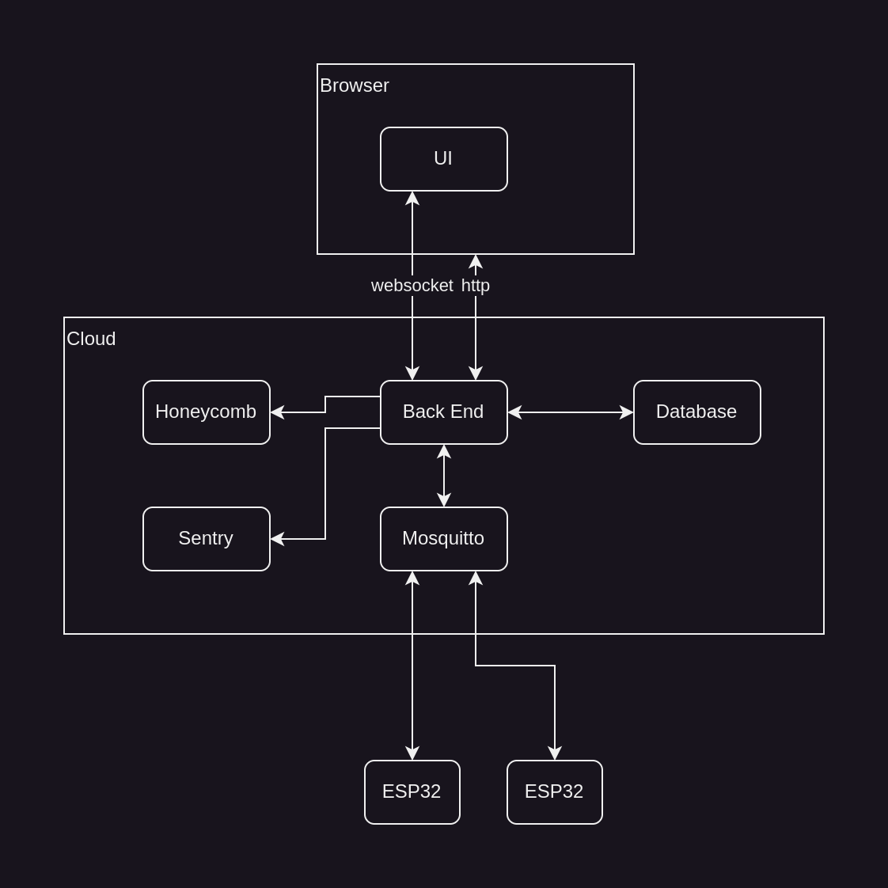

# Basic-IoT-rs

A basic IoT (Internet-of-Things) full-stack application, written in Rust.

## Project Goal

To improve my experience and knowledge of the Rust programming language,
and a small number of popular "Full-Stack" crates, by building a basic Internet of Things
application, with as much of the code written in Rust as possible.

Upon completion, this project will provide a basic demonstration of the use of
Rust in an Internet-of-Things context.

## License

This project is licensed under the [MIT License](LICENSE.md).

## Contributions

As this is a personal project, contributions are not typically accepted.
However, if you have something to offer, please submit a PR and I'll consider it.

If you use this project as the basis for your own, it would be nice to hear about it.

## Requirements

### Control

User can toggle an LED on a specific ESP32 device via:

 * an MQTT message.
 * an HTTP request.
 * interaction with a Web UI.

### Monitoring

User can retrieve the current temperature from a specific ESP32 device via:

 * an MQTT message.
 * an HTTP request.
 * automatic display by a Web UI.

### Stretch Goals

 * Database for historical temperature records.
 * Retrieval of temperature records based on device ID and timestamp range.
 * Display of temperature records in Web UI as a graphical plot.
 * Migrate to HTTPS for secure Back End connections.

### Out of Scope

 * Load balancing.
 * User management.
 * Anything beyond basic security.
 * ESP32 device management (including Over-The-Air updates).
 * Automated upgrades.
 * Anything beyond basic deployment.

## Architecture

### Local Devices

The ESP32 devices will run independently, with Internet access via a local WiFi AP.
They can route to the Internet, to a Mosquitto server, but are not visible from the Internet.

No IoT gateway is required in this project - the ESP32 devices can connect directly to Cloud services.

### Cloud

Within the Cloud, there are three services:

 * Database service, providing data storage and retrieval services to the Back End.
 * MQTT Broker service (e.g. Mosquitto), providing MQTT Broker services.
 * Back End service, providing business logic, database access, and front-end services.

Additionally, the following third-party services may be used:

 * Tracing, for application observability. (Honeycomb?)
 * Error tracking. (Sentry?)

### Front End

Access to the application is via standard Internet browser, such as Firefox.

There are two principal methods for interaction with the Back End:

 * Web API, via HTTP access, for retrieval of static page, and JSON.
 * Websocket API, for realtime retrieval of updates and sending of control. 

### Security

Mosquitto server must be secure.

Database must be secure.

Back end must be secure.

ESP32s must not be exposed to the public Internet.

## Technologies

### Build System

Maybe use Nix to abstract Docker image creation, for reproducible builds:

https://floxdev.com/blog/flox-and-containers

### Deployment

Can we use Nix for this?

### Database

??

### Front-End

Ideally written in Rust (since that's the point):

 * Yew
 * Leptos
 * Dioxus
 * Svelte

Alternatives might be TypeScript, PReact...

## Implementation Plan

### Phase 1 - Local Proof-of-Concept - No Cloud.

Local set-up of Mosquitto and Back End processes in Docker container(s). No database yet.

 * One or two containers?

Start with no-security mode.

Write basic Back End app that can subscribe to topics and receive messages, and send messages.

### Phase 2 - Embedded App

ESP32 application to initialise hardware, connect to local WiFi. Hard-wired WiFI credentials for now (git-crypt?).

Each ESP32 needs a unique ID - MAC address?

Interface and read temperature data from DS18B20 sensor.

Connect unsecurely to Mosquitto, send temperature updates regularly.

Subscribe to a control topic and use this to toggle an LED state.

At this point, the Back End app should be able to receive temperature data, and send LED control commands to the ESP32 devices.

### Phase 3 - Basic HTTP Interface

Extend Back End app to support a basic reporting endpoint, in both HTML and JSON,
allowing the Browser to display the raw data on request.

Simple HTML-style button to toggle LED state - no JavaScript.

### Phase 4 - Web App

Use selected front-end technology to build in-browser Web App (wasm).

### Phase 5 - Database

Integrate selected database technology to log incoming ESP32 data.
It may be better for the database to log directly via MQTT (e.g. Influx via Telegraf),
or the Back End can handle this?

Add retrieval of time series data from database, and provide via HTTP endpoint.

### Phase 6 - Time Series in Web App

Add support for retrieval of time series data from Back End, via Websocket.
Add support for display of data in browser.

### Phase 7 - Security

Harden the interfaces:

 * Enable MQTT access security (authorised connections only).
 * Enable Back End access security (authorised clients only).
 * Enable Database access security (authorised connections only).

### Phase 8 - Cloud Deployment

Determine how to build and deploy application to a Cloud host.

Integrate tracing and error reporting services:

 * Honeycomb for tracing?
 * Sentry for error reporting?

## Resources

### Other Projects

 * [IoT Ruststack Demo](https://github.com/bortyr/iot_ruststack_demo)
 * [rust-iot-2022](https://github.com/mfiumara/rust-iot-2022) - [article](https://betterprogramming.pub/rust-for-iot-is-it-time-67b14ab34b8)

### Videos

 * [A Good Rust Web Stack (YouTube)](https://www.youtube.com/watch?v=pocWrUj68tU)
 * [Building WASM web UI with Rust (YouTube)](https://www.youtube.com/watch?v=ie13kswrWu4)
 * [Build A Full Stack Chatbot in Rust (YouTube)](https://www.youtube.com/watch?v=vAjle3c9Xqc)
 * [An Overview of the Embedded Rust Ecosystem (YouTube)](https://www.youtube.com/watch?v=vLYit_HHPaY)

### Rust on ESP32

 * [The Rust on ESP Book](https://esp-rs.github.io/book/)

